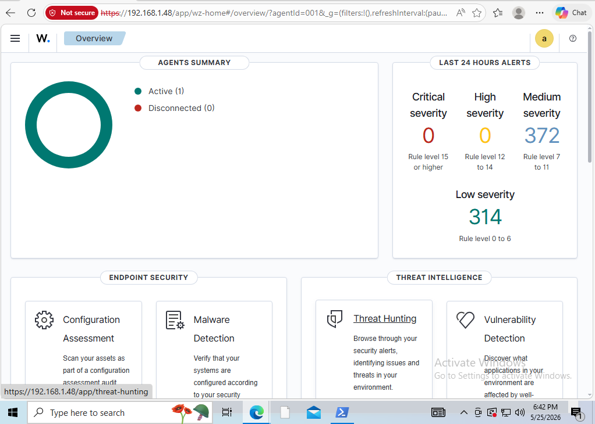
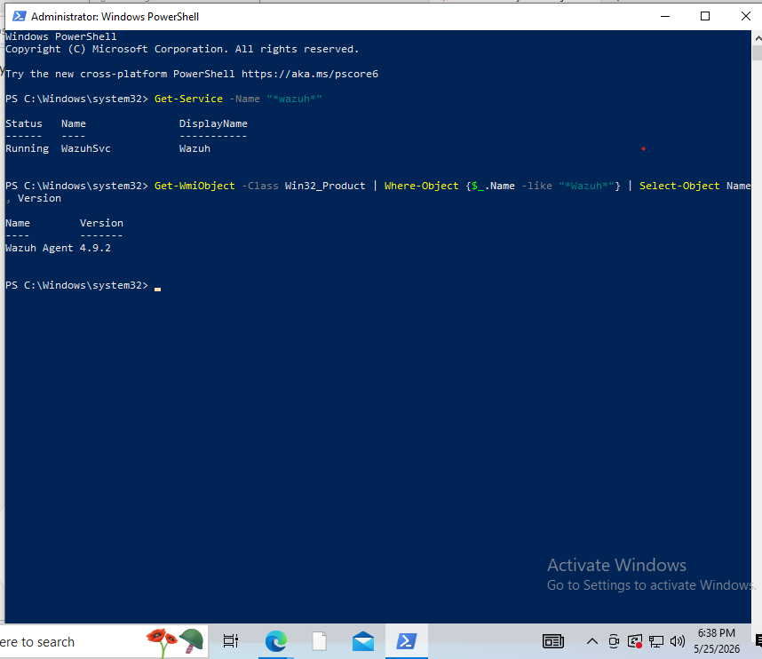
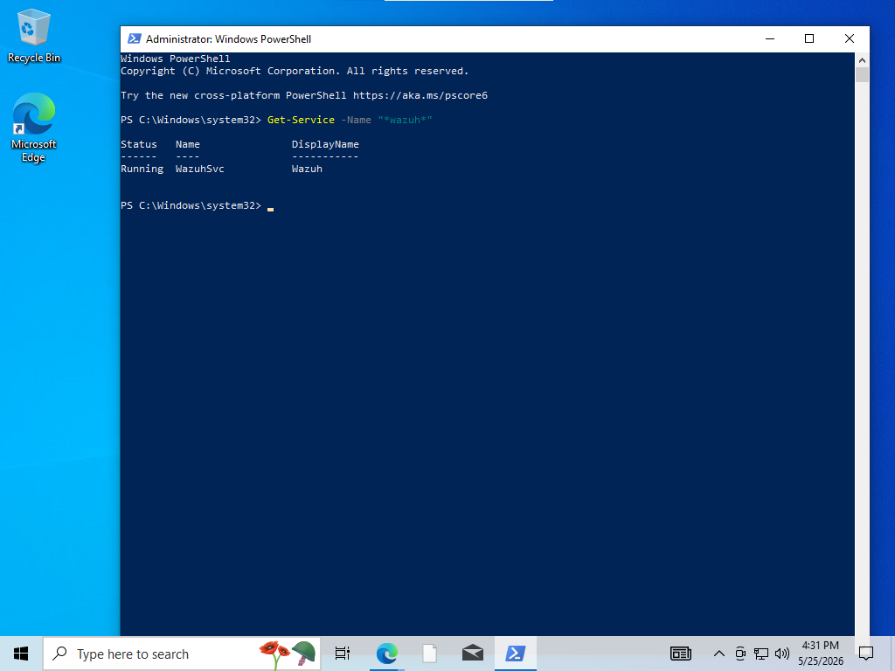
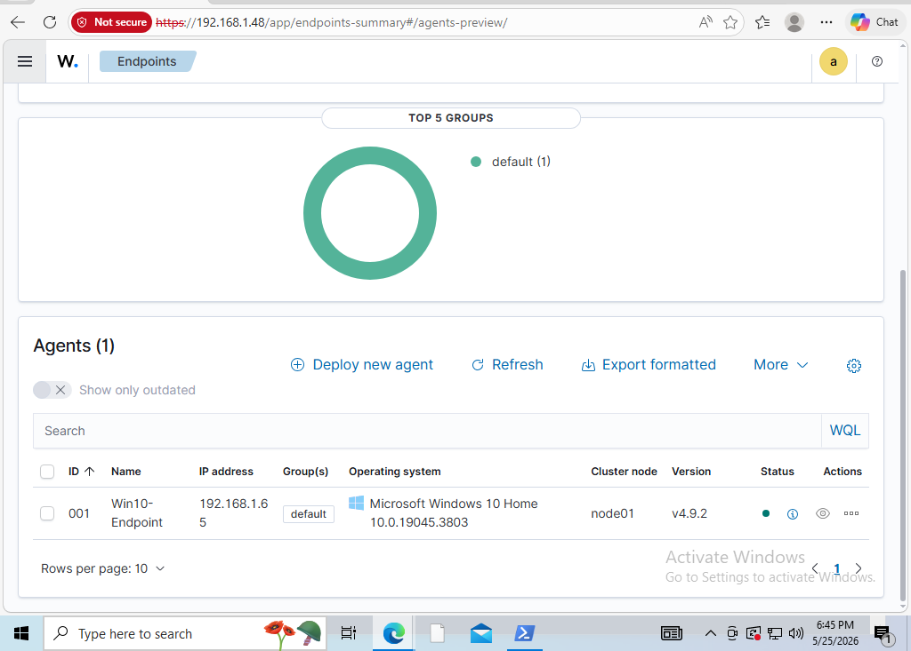
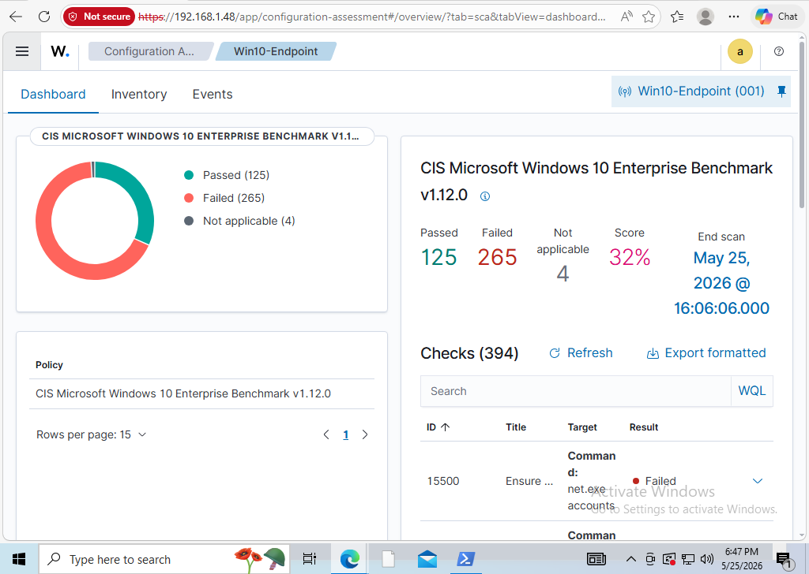
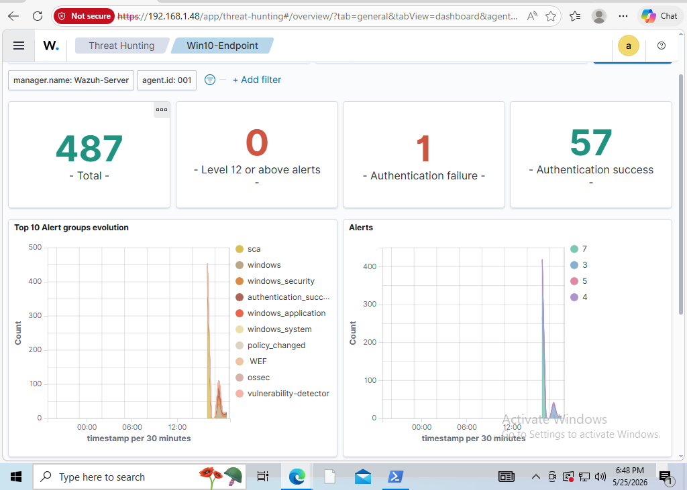

# Project 2: Wazuh Agent Deployment (Windows Endpoint)

## Overview
Deployed a Wazuh agent to an isolated Windows 10 endpoint and connected it to the Wazuh SIEM built in Project 1. This turned the standalone SIEM server into a functional monitoring pipeline — the endpoint now streams live security telemetry, configuration assessments, and event data into the dashboard.

## Architecture
- **Wazuh Manager (SIEM):** Ubuntu 26.04 VM — `192.168.1.48`
- **Monitored Endpoint:** Windows 10 Pro VM (`Win10-Endpoint`) — `192.168.1.65`
- **Network:** Both VMs bridged to the same LAN (192.168.1.0/24), enabling agent-to-manager communication
- **Agent version:** Wazuh Agent 4.9.2
- **Hypervisor:** Oracle VirtualBox 7.x on a Windows 11 host (16GB RAM)

## Steps Taken
1. Created a new Windows 10 Pro VM in VirtualBox (4GB RAM, 2 vCPU, 50GB disk) using the official Microsoft Windows 10 ISO.
2. Confirmed both the Wazuh server and Windows endpoint were on the same bridged network:
   - Wazuh server: `192.168.1.48` (`ip addr show`)
   - Windows endpoint: `192.168.1.65` (`ipconfig`)
3. In the Wazuh dashboard, used the **Deploy new agent** wizard to generate a Windows MSI install command, specifying the manager IP (`192.168.1.48`) and agent name (`Win10-Endpoint`).
4. Opened the Wazuh dashboard directly inside the Windows VM (`https://192.168.1.48`) to copy the install command locally, avoiding cross-VM clipboard issues.
5. Ran the install command in an **Administrator PowerShell** session, which downloaded and silently installed the agent MSI.
6. Started the agent service and verified it was running.
7. Confirmed the endpoint registered as **Active** in the Wazuh dashboard, with live data flowing into multiple modules.

## Install Command
```powershell
Invoke-WebRequest -Uri https://packages.wazuh.com/4.x/windows/wazuh-agent-4.9.2-1.msi -OutFile $env:tmp\wazuh-agent; msiexec.exe /i $env:tmp\wazuh-agent /q WAZUH_MANAGER='192.168.1.48' WAZUH_AGENT_NAME='Win10-Endpoint'
```

## Validation
Verified the agent service was running on the endpoint:
```powershell
Get-Service -Name "*wazuh*"

Status   Name        DisplayName
------   ----        -----------
Running  WazuhSvc    Wazuh
```

Confirmed in the dashboard:
- **Agents Summary:** Active (1), Disconnected (0)
- **Configuration Assessment:** CIS Microsoft Windows 10 Enterprise Benchmark v1.12.0 auto-scan completed — 394 checks (125 passed, 265 failed, 32% score). The low score is expected for a default, unhardened Windows install and demonstrates how the SCA module identifies hardening gaps against an industry baseline.
- **Threat Hunting:** Live security events flowing from the endpoint.

## Troubleshooting Notes
- **Wrong service name:** `net start wazuh-agent` failed with "The service name is invalid." On Windows the Wazuh service is named **WazuhSvc**, not `wazuh-agent`. Resolved with `Start-Service WazuhSvc` and confirmed with `Get-Service -Name "*wazuh*"`.
- **Cross-VM clipboard:** Copying the install command between the Linux server VM and the Windows VM was unreliable. Solved by opening the Wazuh dashboard directly inside the Windows VM and copying the command locally before pasting into PowerShell.
- **Administrator privileges required:** The MSI install must be run from an elevated PowerShell session — a standard prompt fails silently.

## Skills Demonstrated
- Wazuh agent deployment to a Windows endpoint
- Agent-to-manager enrollment and configuration
- VM networking (bridged adapters, verifying same-subnet connectivity)
- Windows service management (PowerShell, `Get-Service`, `Start-Service`)
- Reading and interpreting CIS benchmark / Security Configuration Assessment (SCA) results
- Validating SIEM data ingestion end to end


## Screenshots

**Agent Active in Dashboard**


**PowerShell Install Command**


**WazuhSvc Running (Get-Service)**


**Endpoint Details**


**CIS Benchmark Scan Results**


**Security Events Flowing**

